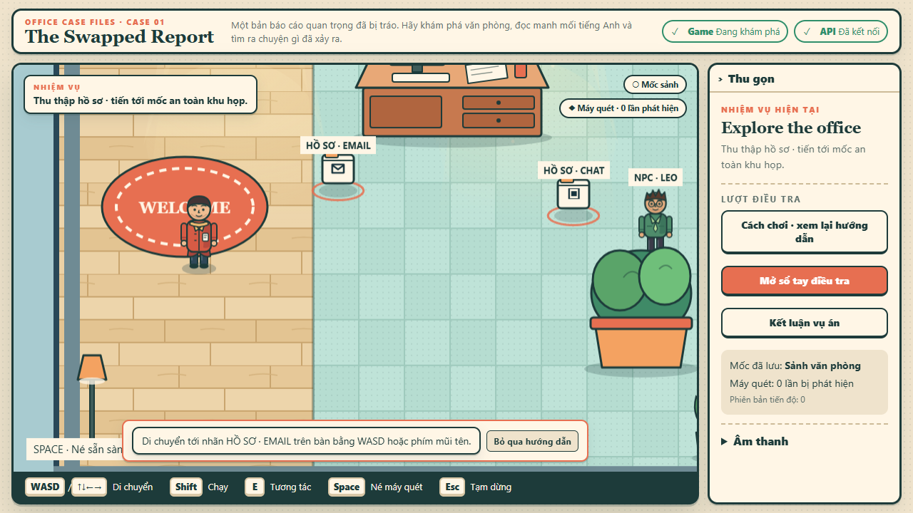
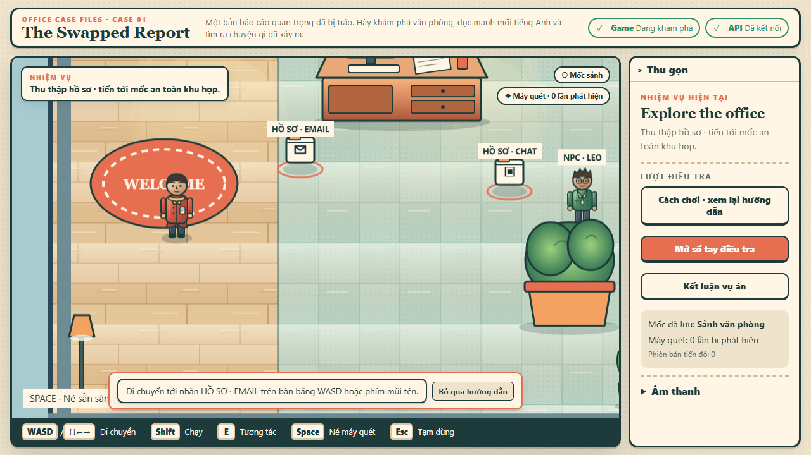

# T38 — Phaser 2.5D visual-quality QA

Date: 2026-09-27
Branch: `codex/m1-version-two`
Scope: original office SVG materials and existing character sprite-sheet frames only.

## Before / after

Both captures use the same M1 opening scene, 1280×800 viewport, current React/Phaser/API code and onboarding state. The “before” browser request handler serves tracked T37 SVGs from Git `HEAD`; the “after” serves regenerated T38 assets. The capture-only test was temporary and has been removed.

| T37 art | T38 art |
| --- | --- |
|  |  |

The room now has warmer floor and desk shading, softer highlights, layered cabinet/cooler/foliage materials, and clearer cast shadows. In the side-by-side stills the room finish is visibly richer, while the individual character improvement is more modest at gameplay scale. The other headed capture showed Nora's raised-arm reaction, but still images do not prove that acting reads clearly in motion.

## Performance and payload

- Final T38 M1 critical journey measured **60 fps, p95 17 ms** in two serial headed samples at 1280×800 on Windows/Playwright Chromium. Both samples match the two-sample T37 baseline. The accepted local frame target is p95 ≤33 ms.
- The visual-state test measured **991,549 bytes** for `/assets/`, compared with the T37 sample of 932,830 bytes: **+58,719 bytes (about 6.3%)**. The separate, gesture-loaded 3.84 MB office ambience MP3 is not included.
- T38 initially included unused gradient definitions in every office SVG. Splitting definitions by asset reduced the measured T38 asset transfer from 1,006,792 to 991,549 bytes (**15,243 bytes saved**) without changing appearance.
- The owner's exact target computer, ordinary browser and network profile remain unknown. These samples do not establish target-device/load acceptance.

## Verification evidence

| Gate | Result | Evidence / limit |
| --- | --- | --- |
| Generator outputs and art contracts | Pass | Both generators completed. `officeArt.test.ts` and `characterArt.test.ts`: 11/11 after final SVG generation; dimensions, ids, foot anchors, state-frame count, SVG validity and fallback contract preserved. |
| Web lint / typecheck | Pass | Direct invocation through bundled Node runtime; no application TypeScript changed. |
| Web unit suite | Pass | 19 files / 61 tests before the final office-only unused-definition reduction; the focused 11 art tests passed again after that last generation. |
| Production build | Pass | Final Vite build succeeded to a new task-specific output directory under the Codex visualization root. The default `apps/web/dist` build path returned `EPERM` while clearing its existing output, so it was left untouched. Vite still reports the existing `advancedChunks` deprecation and large Phaser chunk. |
| Headed E2E | Pass, 8/8 | Final art revision; visible Chromium; API 5063 / Web 5174; includes M1 path, translation toggles, talk/react/dodge assertions, retry, replay, all assets, missing-art fallback, reduced motion and offline-readable UI. |
| Docs and diff checks | Pass | `scripts/check-agent-docs.ps1` passed (39 task files); `git diff --check` passed. |
| Target-device / human validation | Open | AI roleplay is only hypothesis feedback. No external participant was contacted; consent/retention/compensation and exact target device are unresolved. |

No collision, coordinates, story, React/DOM content, scoring, input, scanner schedule, checkpoints, server data, dependencies or licensing changed. No external asset, deployment, spend or participant contact occurred.

## AI roleplay review and next gate

Five independent simulated roles generally found the mission and evidence trail understandable and wanted to reach Nora. Their repeated risks and distinct recommendations are synthesized in [T38 AI roleplay feedback](../research/T38-ai-roleplay-synthesis.md). The reports are not real comprehension, enjoyment or purchase evidence.

**M2 recommendation:** run a bounded owner-led 5–8 learner validation pilot after the target-device and consent/data-retention gates are resolved. Agree success criteria before the sessions; observe clue interpretation, optional-translation use, scanner discovery/retry, whether the working-theory note feels skippable, and desire to continue. Then estimate case art/audio costs and decide whether to fund a second case. Do not proceed to case-pack production, checkout or paid acquisition from AI roleplay alone.

## Improvement review

- Result: `none`.
- Observation/evidence: no reusable process change was established. Asset-specific SVG definitions removed 15,243 measured bytes without changing artwork; this is a scoped optimization, not a new project-wide rule.
- Mechanism: no skill, script, test or permission rule promoted.
- Validation: art unit tests, final headed E2E, production build to an isolated output path, docs check and diff check passed.
- Follow-up: reassess character readability and the scanner in the owner's planned real-learner sessions; do not treat roleplay as a substitute.
